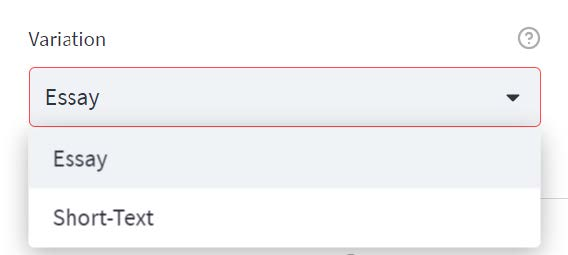
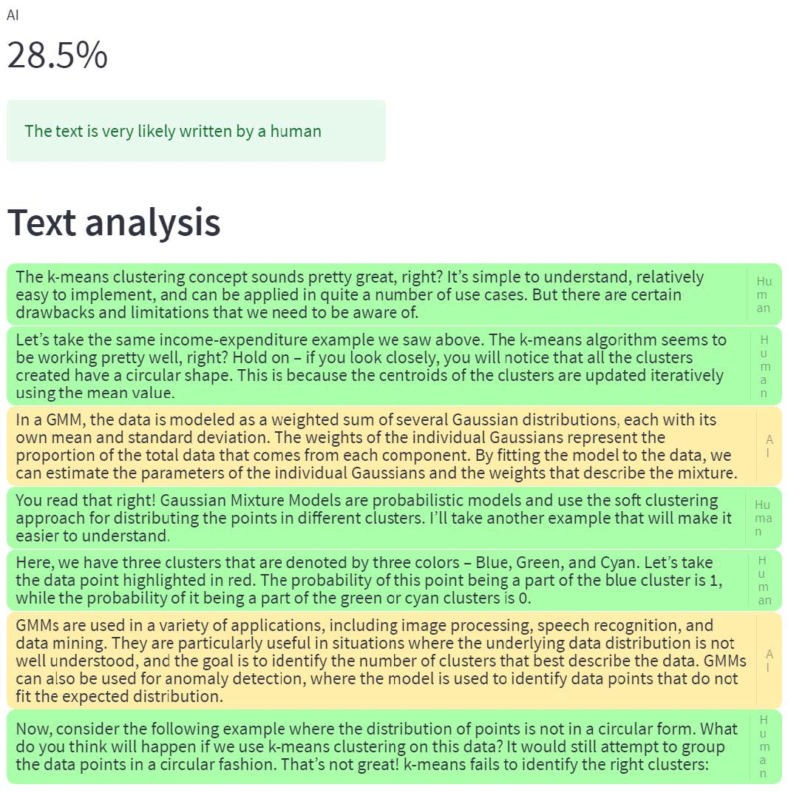
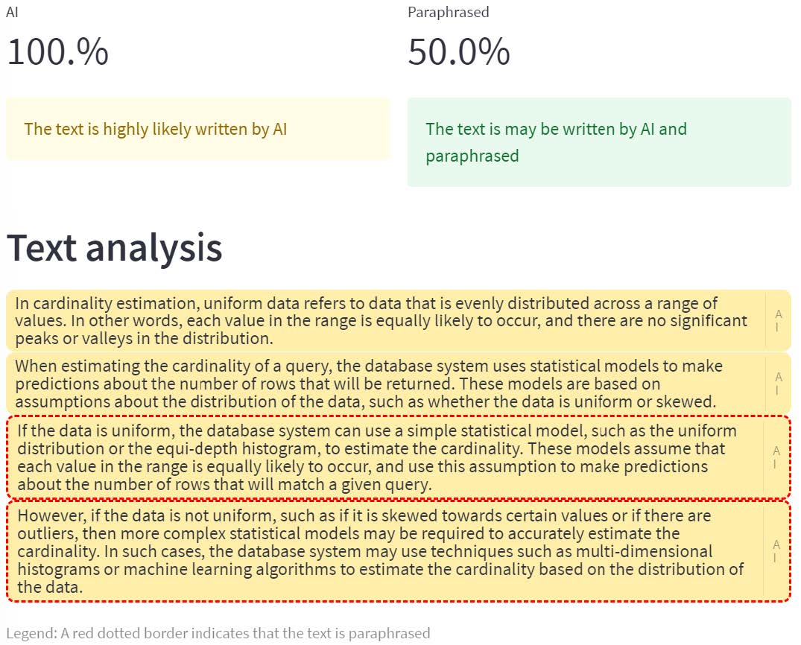
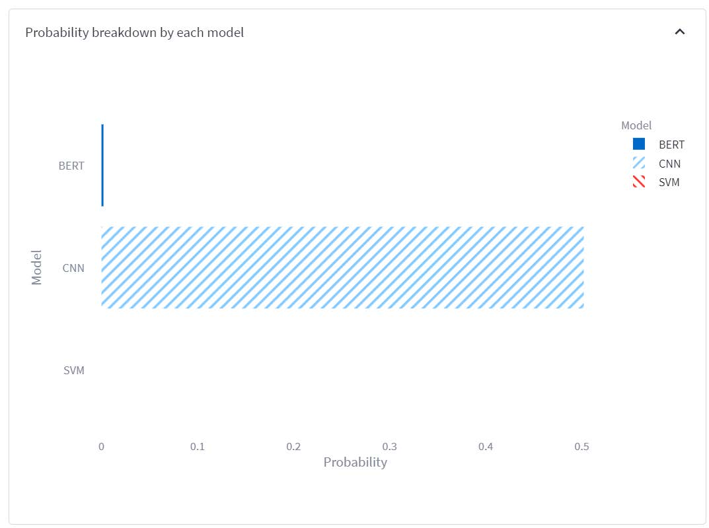
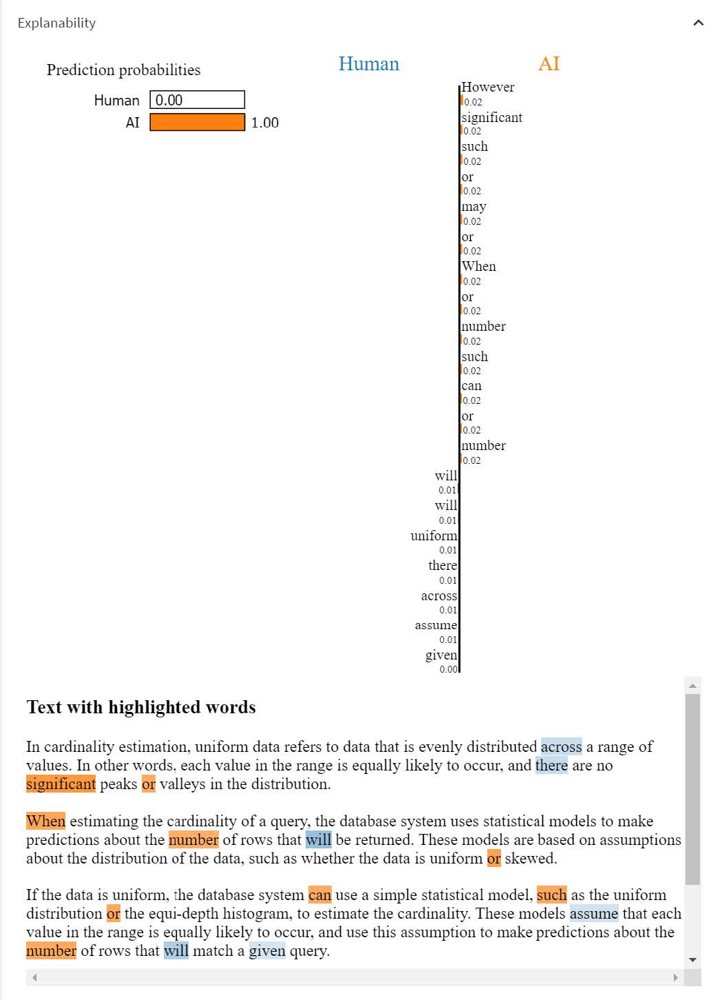
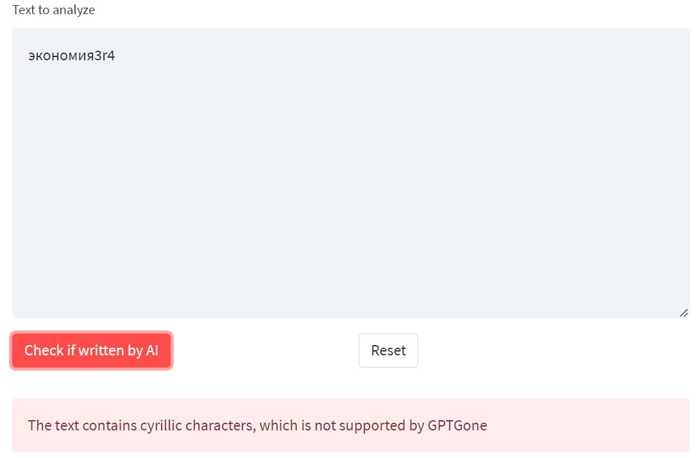

# GPTGone: an advanced ChatGPT detector

This is a project for the AI course, 50.021, at the Singapore University of Technology and Design.

GPTGone is a project that aims to detect whether a given piece of text is written by humans or ChatGPT. It consists of an ensemble, boasting a 96% accuracy rate in classifying texts.

Check out our hosted web GUI, built using Streamlit, at https://huggingface.co/spaces/GPTGone/GPTGone

## Features
GPTGone has 5 main features:
1. ChatGPT content detection
2. Paraphrased ChatGPT content detection
3. Probability breakdown by each model (to know each model’s prediction)
4. Explainability generation
5. Cyrillic character detection (to prevent bypassing by mapping English alphabets to Cyrillic characters)

### ChatGPT Content Detection
GPTGone provides a way for users to validate if a piece of text is written by humans or ChatGPT. The web app has 2 variations, “Essay” and “Short-Text”.

<p align="center">
  
</p>

When using the “Essay” variation, there will be no character limit on the size of input a person can enter as the input will split into smaller chunks when the models’ token limit is exceeded. On the other hand, when using the “Short-Text” variation, the user input will be truncated when it exceeds the model’s token limit, however, it will return a more accurate prediction than the Essay variation since our model was trained on the whole text. Hence it is most suited for text that is less than 2000 characters long, given the token limit for BERT is 512 tokens.

<p align="center">
  
</p>

### Paraphrased ChatGPT Content Detection
GPTGone is also capable of detecting ChatGPT-generated content that was paraphrased using a paraphraser like T5. Our model is currently only trained with T5 paraphrased inputs, in the future, we may explore other paraphrasers to bolster the robustness of the model.

<p align="center">
  
</p>

### Probability Breakdown by Each Model
GPTGone is able to display the individual predictions of each model, for users who are curious about the predictions of the constituent models in the ensemble.

<p align="center">
  
</p>

### Explainability Generation
For the users that would like to understand why their input is classified as AI-written or human-written, GPTGone offers an explanation generator as well. Currently, the explanation generator only supports explanations by our SVM model due to the expensive computational costs of the BERT and CNN models.

<p align="center">
  
</p>

### Cyrillic Character Detection
Another important feature of GPTGone is the capability of detecting the Cyrillic alphabet, to
prevent bypassers from converting text to the Cyrillic alphabet and bypassing GPTGone.

<p align="center">
  
</p>

## How to run GPTGone locally
Requirement: python version >= 3.9
1. If git lfs is not installed, install it using this command: 
    ```bash
    git lfs install
    ```
2. Clone the repository from https://huggingface.co/spaces/GPTGone/GPTGone
    ```bash
    git clone https://huggingface.co/spaces/GPTGone/GPTGone
    ```
3. Change your directory into GPTGone using:
    ```bash
    cd GPTGone
    ```
4. Create a new virtual environment at the root of the project directory.
    ```bash
    py -m venv venv
    ```
5. Activate the virtual environment.

    Mac:

    ```bash
    source ./venv/bin/activate
    ```
    Windows:
    ```bash
    venv\Scripts\Activate.ps1
    ```
6. Install the requirements using:
    ```bash
    pip install -r requirements.txt
    ```
7. Run this command to spin up the local server: 
    ```
    streamlit run App.py
    ``` 
8. Visit the URL displayed on the terminal to open up the web application.
